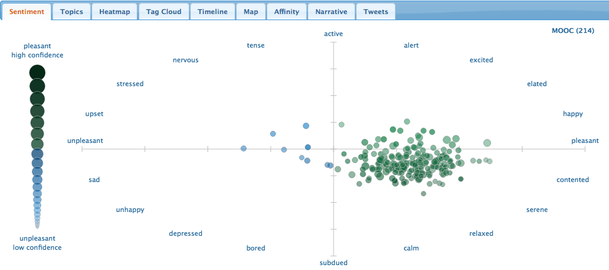

# Project Proposal

## Background
A massive open online course (MOOC) is a special type of online course aimed towards a large group of participants and is openly accessible via the internet. MOOCs are a fairly recent development in open distance education and are mostly non-credit granting and free [(Florida Tech)](https://libguides.lib.fit.edu/c.php?g=427753&p=2917513). Due to the ever increasing number of MOOCs and their wide popularity we propose a project that will study the history, usage, success, and impact of MOOCs. As this is a small scale project, we would like to apply for the *Student Development Grant* to aid us in the execution of this project.

This project aims to answer the following questions surrounding MOOCs:
* Who are the learners that sign up for MOOCs? What is their educational background, where are they located, and what is their motivation for enrolling in a MOOC?
* Are MOOCs an effective method of learning? That is, how many people actually complete these courses and feel that it was an effective way to learn new concepts?
* Who are the major players and what makes them successful?
* Could MOOCs replace or transform current methods of traditional education (e.g. secondary school, college, and university)? That is, to what extent are educational institutions adding online courses, similar to MOOCs, to their curriculum?

We will employ a variety of Digital History methods to answer these research questions, as detailed in the next section, due to the large amount of data to be reviewed. Due to MOOCs naturally being digital, as they were created in only the past decade and only live online, these methods will be vital in conducting our research since they are the most efficient and effective way to analyze data on MOOCs.

## Materials and Methods
This project will use several digital history methods, with inspiration from [scholars of Rice University](https://ricedh.github.io/) to answer our research questions. Listed below are the methods and tools we plan to use for this project.

* Mapping geographic points to create graphics representing students enrolled in MOOCs. [ArcGIS Online](https://www.arcgis.com/index.html) will be used to create digital maps for visualization and analytical purposes of understanding the learners of MOOCs.
* Topic modelling to find a group of words (i.e. topic) from a collection of MOOC materials that best represents the information in a MOOC or collection of MOOCs. This method will also be used for discovering patterns in student feedback/comments for MOOCs. This will aid us in aggregating the vast amount of material to form a picture of MOOCs and find answers to our research questions. [Carrot2](https://search.carrot2.org/#/search/web/MOOC/pie-chart) will be utilized as a starting point to understand what types of search results are frequent regarding MOOCs. [Mallet](http://mallet.cs.umass.edu/topics.php) will be used as our main topic modelling tool to discover clusters of words frequently occuring together.
* Analyzing social media history (e.g. Twitter) to understand the sentiment, impact, and relevance of MOOCs. The [NCSU Tweet Sentiment Visualization App](https://www.csc2.ncsu.edu/faculty/healey/tweet_viz/tweet_app/) will be used for analyzing tweets and creating scatter plots showing the overall pleasantness and emotions surrounding keywords related to MOOCs.
* Statistical analysis for quantitative data obtained on MOOCs. We will use [RStudio](https://rstudio.com/) to calculate statistics and plots.

<figure>
    
    <figcaption>Figure 1. Keyword MOOC's sentiment according to the NCSU Tweet Sentiment Visualization App.</figcaption>
</figure>

### Research Plans
In order to conduct thorough research for this project, we will need to enlist three or four research assistants and/or collaborators to define relevant terms/metrics for this project, gather literature, review literature, and analyze data.

The results of this research would be of concern mainly to educational institutes, companies offering MOOCs, and educators and students. A presentation at a conference on educational methods would be an appropriate method of sharing the findings of this research. We estimate it would take around a month to plan such a presentation. 

## Timeline
It is estimated that around six to seven months will be required to complete this project. We will break down the project work into three stages and outline the goals for each stage and the estimated required time.

#### Stage 1: Establish Metrics to Measure MOOCs (1-2 weeks, 2 researchers)
Before reviewing the usage, success, and impact of MOOCs, we must first create metrics to measure values in these categories. For instance, we need to determine what makes a MOOC a successful method of delivering and teaching concepts to learners. This could potentially be measured by completion rate, positive student feedback, and/or enrollment numbers for a particular MOOC or series of MOOCs throughout time.

#### Stage 2: Gather the Literature (1-2 months, all researchers)
Due to MOOCs only being around for the past decade, the vast majority of literature to be reviewed is digital and in many forms. For this project, we will need to gather literature on companies and organizations that offer MOOCs and gain access to their statistics of MOOCs and MOOC users. This may prove to be difficult as many of these for-profit companies could be unwilling to disclose this information.

#### Stage 2: Review the Literature (2 months, all researchers)
Now that we have metrics to measure MOOCs with and literature to review, we can learn more about MOOCs to investigate our research questions. We will utilize the methods and tools described earlier to conduct this research. The information discovered during this stage will help us understand MOOCs in respect to our research questions.

#### Stage 3: Analyze the Data (1 month, 2 researchers)
After the literature review, we will have data to analyze. We will use our methods and tools for spatial visualization and analysis, topic modelling, tweet analysis, and statistical analysis. The results of this analysis will be reviewed and summarized in a manner directly related to the research questions.

## Importance
As the popularity of MOOCs continue to rise, we need to seriously consider their impact on the educational landscape. MOOCs are rapidly transforming the way concepts in multiple disciplines are being taught and delivered to people around the world. Naturally, people will wonder if this type of online education is a threat to traditional educational institutions such as universities and more importantly if it is a better way of teaching people new concepts. Moreover, MOOCs are revolutionary in the fact that they are not built to protect privilege like elite colleges [(Neklason)](https://www.theatlantic.com/education/archive/2019/03/history-privilege-elite-college-admissions/585088/). Instead, the entire purpose of MOOCs is to provide free and open education to everyone. This is quite the departure from the exclusivity that formed these elite colleges. Investigation into this topic will help us to better understand this new educational methodology and determine whether it can become a new educational standard around the world.

## Budget
The [budget](https://docs.google.com/spreadsheets/d/1pJfymkPvX6KK-wItS-J6n_KHwkNrRAms-onAKxE2wYo/edit?usp=sharing) for this project mainly consists of paying researchers for their time and access to some online tools. The majority of tools used in this project are free, thus the budget will account for money towards indirect costs of the project such as travel and equipment costs.